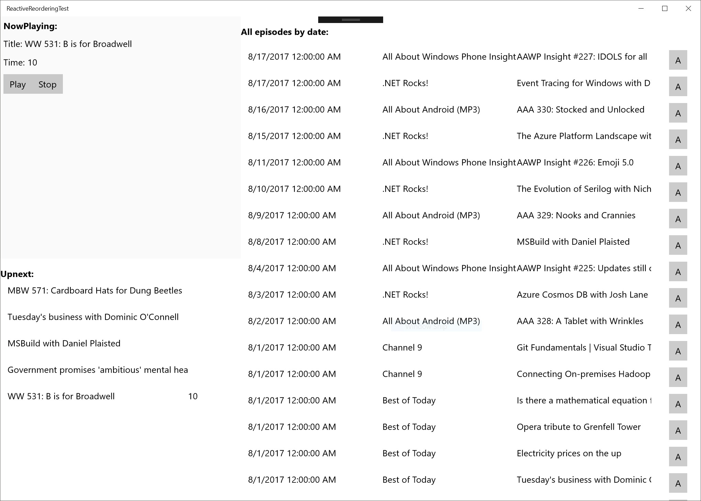

# ReactiveReorderingTest
Testing out how to build a Windows UWP, along with iOS and Android versions containing a reorderable list of items using [Realm](http://realm.io), MVVMLite, .NET Standard 2.0 and Xamarin forms.  The goals of the project are 

1. Experiment with Realm for use as a reactive model layer to power a reactive UI layer
1. Experiement with a XAML Itemsource based on INotifyCollectionChanged, System.Collections.IList, IItemsRangeInfo, ISelectionInfo stuff.. a better way of doing list virtualization in XAML than IncrementalLoadingCollection (more control, new scenarios like grouping)
1. Experiment with MVVM using MVVMLite and x:Bind
1. Experiment with dotnet standard 2 UWP support in fall creators update as well as Xamarin forms
1. Kick the tyres of Realm's object server for realtime data updates across end points

and these are in turn motivated by experiences I've had co-developing the [BringCast Windows UWP app](http://bringcast.com).

## A little bit of BringCast Backstory
Mark Osborn and I learned many interesting lessons in our journey building the BringCast 4.0 release.  When we started on the release, we had certain constrains born out of our timing.  For example there was no Entity Framework support for SQLITE at the time which lead us to have to build our own ORM and deal with all the file locking, threading issues that came with it.  This was massively complicated by how much more asynchronous the UWP platform is compared to Silverlight which went before it where we were more used to managing our own background threads.  We learned a lot doing this.

Another constraint was around the view pattern we used to build the UX.  At the time, x:Bind didn't exist and we were reticent adopting MVVM / old school databinding due to concerns over performance.  This lead us down a custom MVC route.  While we did pull off the BringCast 4.0 release, we've had overwhelming feedback from users that stability is not as good as previous versions. In part this tems from the complexity of the codebase and some of the above choices which have come to bite us.

Which brings us to today.

## Realm
Realm is a SF based startup who, according to [their website](http://realm.io), make it easy to build modern reactive apps, realtime collaborative features, and offline-first experiences.  I've been tracking them for a while and have been meaning to look into their stuff.  The catalyst for this was when I recently became aware of their dotnet port which they confusingly refer to as Realm Xamarin(.NET) but seems to work just fine in other .NET environments such as UWP.  The latest docs are here: [https://realm.io/docs/xamarin/latest/](https://realm.io/docs/xamarin/latest/)

## The Prototype

With the goals stated above, the rough plan / TODO list for this prototype is:

1. Get basic up next queue mocked using Realm / MVVMLite / x:Bind up including support for list virtualization and reordering 
1. Prototype a all episodes view to test scalability / performance of the ORM and try out some other UI improvements such as grouping by day
1. Get a basic XAMARIN forms version going on iOS and Android using .NET standard 2.0
1. Play with Realm mobile server for cross device syncing

So far, 1 has been accomplished which is what is reflected in the repo.

## Phase 1
The UI is all test quality: there is a now playing section and an up next list representing the next episodes (this is using the well trodden podcast scenario as you may have guessed from above :-).  


These are bound to a backing viewmodel which in turn wraps this model class

```cs
using Realms;
using System.Collections.Generic;

namespace ReactiveReorderingTest.DataModel
{
    public class UpNextQueue : RealmObject
    {
        public Episode CurrentEpisode { get; set; }

        public IList<UpNextQueueEntry> Queue { get; }
    }
}
```

Only one of these is needed and it is loaded on app start with the following code:

```cs
r = Realm.GetInstance("testdb");

var queue = r.All<UpNextQueue>();

this.UpNext = queue.FirstOrDefault();

```

The UI is all bound to this object using x:Bind:

```xml
<TextBlock FontWeight="Bold">NowPlaying:</TextBlock>
            <TextBlock Text="{x:Bind ViewModel.UpNext.CurrentEpisode.Title}">CurrentEpisodeTitle</TextBlock>
            <TextBlock Text="{x:Bind ViewModel.UpNext.CurrentEpisode.PlaybackState.ElapsedTime, Mode=OneWay}">CurrentEpisodeTitle</TextBlock>
```

and there is a custom itemsource that manages the item realization for the upnext queue as well as the reordering logic

```cs
public class RealmVirtualOrderedUpNextEntrySource : INotifyCollectionChanged, System.Collections.IList, IItemsRangeInfo, ISelectionInfo
{
    ...
}
```

This is very much hacked together with no attempt to make a generic solution for doing a reusable implementation at this point.

If you build and run Phase 1 here are some of the interesting things you will observe.  

1. When the play button is pressed, a simulated playback starts to run which causes a counter to increment in the listview as well as in the now playing UI.  Under the covers, the playback simulation is a simple loop running on on a background thread doing this:

    ```cs
    var task = Windows.System.Threading.ThreadPool.RunAsync((s) =>
    {
        var threadsRealm = Realm.GetInstance("testdb");
        var data = threadsRealm.All<UpNextQueue>().FirstOrDefault();

        while (playing && data != null)
        {
            var tx = threadsRealm.BeginWrite();
            if (data.CurrentEpisode.PlaybackState == null)
            {
                data.CurrentEpisode.PlaybackState = new PlaybackState();
            }

            data.CurrentEpisode.PlaybackState.ElapsedTime += 1;
            tx.Commit();

            Task.Delay(1000).Wait();
        }
    });
    ```

    As you can see, the thread is talking directly to what is apparently a different instance of the object that was retreieved seperately.  What's interesting, though is that:

    __Thread safety__: When calling the datamodel, no need to worry about invoking using the dispatcher or locking to guard against writes.  Just go ahead and update our copy of the object and Realm will do the right thing. 

    __Identity__: Because Realm treats entities returned from a database query as managed objects and tracks instances across threads as a single logical instance with full thread safe update semantics, the world is much simpler and nicer than one where every object returned from the same query but at different times is always stale and disconnected.  These are live objects that are all kept in sync and updated.

    __Eventing__:  Building on the above, one of Realm's selling points is that it is fully realtime meaning that as objects are updated they fire change notifications.  This is done from the light weight (relative to DependencyObject at least) INotifyPropertyChanged.  This in turn makes it super easy to ensure that the UI is up-to-date with databinding

    __Durability__: Modifying any "instance" of an object in a write transaction persists the change to the local MYSQL backing store.

2. If you drag and drop to reorder items whist the simulated playback is happening, notice that the UI just does the right thing even though the ListView contents are being mutated by the data updates.

The above is totally awesome, no doubt.  I have not done extensive performance measurements yet to see at what cost this comes, however, in terms of the shear paucity of code needed to pull off this prototype compared to what we have in the current BringCast data / UI layers I'm willing to give up a bit of performance for the correctness and simplification it might bring to the codebase.  As we move on to latter phases, we'll find out more about the overall performance characteristics / scalability of this approach accross thousands of objects and more complex queries.  But color me impressed at this stage.

## Phase 2
In the second phase, I've added another listview that shows an "infinitely" scrolling list of episodes.



  Some of the things I wanted to look into in this investigation were how well Realm would perform in a data virtualization scenario as well as how easy / hard it is to implement a XAML listview backed by a custom ItemSource built using INotifyCollectionChanged, IList, IItemsRangeInfo, ISelectionInfo which is the required set of interfaces needed to do build a virtualizing listview ItemSource.

Getting the virtualizing datasource going with realm

MVVM item wrappers and commands

First Realm Limitation: no support for skip and take

